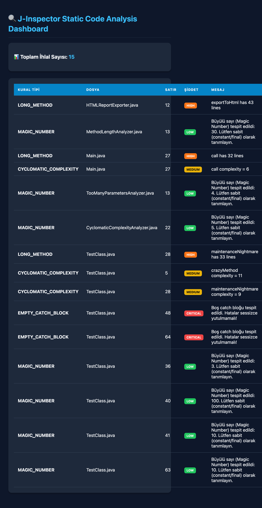

# 🔍 J-Inspector: Static Code Analysis Engine (v3.0)

[](https://www.oracle.com/java/)
[](LICENSE)
[](docs/presentation.html)
[]()

**J-Inspector**, Java projelerinde kod kalitesini, sürdürülebilirliği ve güvenlik açıklarını analiz eden AST (Abstract Syntax Tree) tabanlı, yüksek performanslı bir statik kod analiz aracıdır.

---

## 📊 Öne Çıkan Özellikler & HTML Dashboard

- 🚀 **Yüksek Performans (Multithreading):** Paralel tarama altyapısı sayesinde binlerce satırlık kod tabanlarını milisaniyeler seviyesinde tarar.
- 🎨 **Modern HTML Dashboard:** Analiz sonuçlarını detaylı, filtrelemeye uygun ve dark-mode temalı etkileşimli bir dashboard üzerinde raporlar.
- 📊 **Executive Presentation:** Projenin teknik mimarisini ve kurumsal sunumunu barındıran etkileşimli [Slide Deck](docs/presentation.html).
- 🛠 **Zengin Analiz Kuralları:**
    - 🛑 `EMPTY_CATCH_BLOCK` (Critical): Sessizce yutulan hataları ve boş catch bloklarını yakalar.
    - ⚠️ `LONG_METHOD` (High): Okunabilirliği düşüren aşırı uzun metotları tespit eder.
    - 🔄 `CYCLOMATIC_COMPLEXITY` (Medium): Karmaşık kontrol akışlarına sahip metotları raporlar.
    - 🔢 `MAGIC_NUMBER` (Low): Kod içinde doğrudan kullanılan sabit sayıları tespit ederek refactoring önerir.
- 💻 **CLI / Terminal Desteği:** Picocli entegrasyonu ile tüm komut satırı parametrelerini destekler.
- 📄 **JSON Raporlama:** CI/CD süreçleri ve otomasyonlar için makine tarafından okunabilir JSON çıktısı üretir.

### 🖼️ Ekran Görüntüsü (HTML Raporu)

<p align="center">
  
</p>

---

## 🛠 Mimari & Teknolojiler

- **Dil:** Java 17+
- **Ayrıştırıcı (Parser):** JavaParser (AST Analizi)
- **Komut Satırı Arayüzü:** Picocli
- **Raporlama:** Custom HTML/CSS Exporter & JSON Writer
- **Derleme Aracı:** Apache Maven
- **Geliştirici & Eser Sahibi:** Halise Ezgi Mutlu

---

## 🚀 Kurulum ve Çalıştırma

### 1. Projeyi Derleyin (Fat-JAR Oluşturma)
```bash
mvn clean package